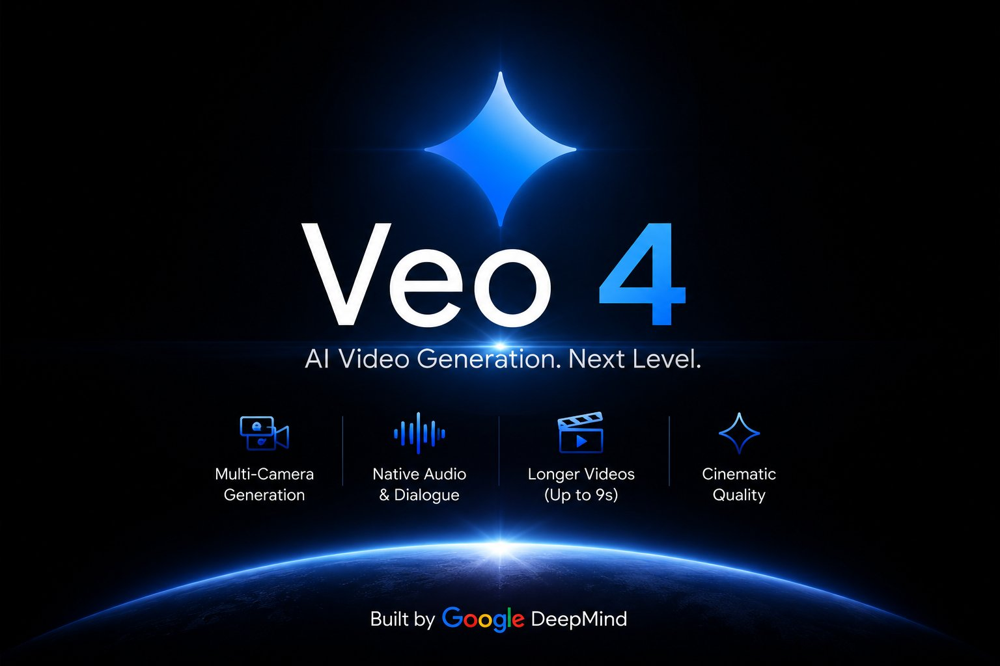
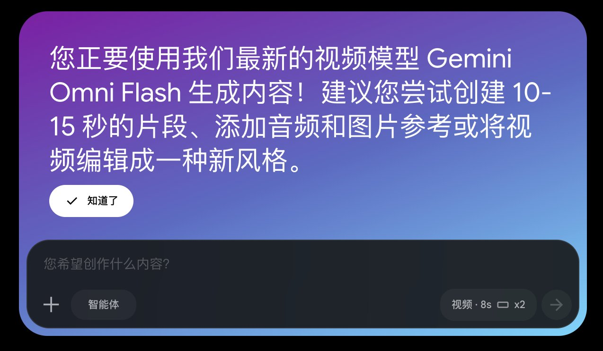
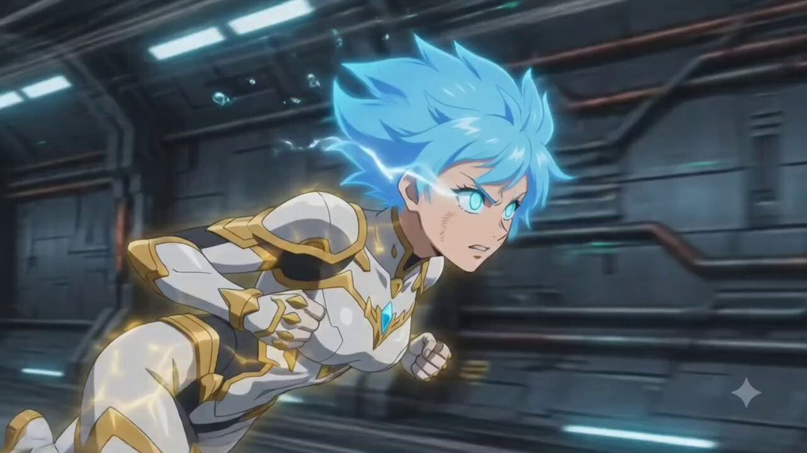
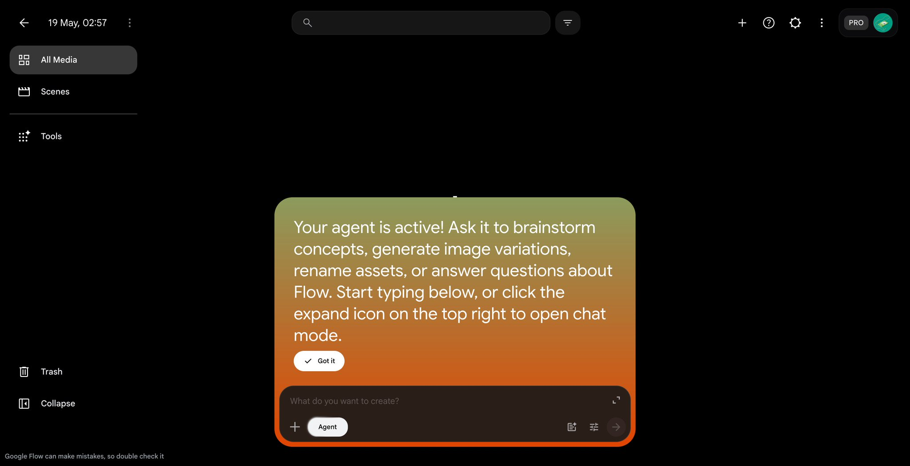

<div align="center">

# Awesome Veo 4 Prompts

Community-discovered Veo 4 / Gemini Omni / Omni Flash prompts and X/Twitter examples for AI video generation.

</div>

## 🍌 Introduction

This repository tracks early Veo 4-related examples found on X/Twitter. The naming is still messy in community posts: people refer to the same wave of Google video-model leaks/tests as **Veo 4**, **Veo4**, **Veo Omni**, **Gemini Omni**, or **Omni Flash**.

## 📑 Menu

- [Case 1: Multi-angle scene generation leak](#case-1-multi-angle-scene-generation-leak)
- [Case 2: Background music support](#case-2-background-music-support)
- [Case 3: Voice consistency, video editing, and multi-reference input](#case-3-voice-consistency-video-editing-and-multi-reference-input)
- [Case 4: Cyberpunk hacker robot demo](#case-4-cyberpunk-hacker-robot-demo)
- [Case 5: Flow / Gemini Omni availability screenshot](#case-5-flow--gemini-omni-availability-screenshot)
- [Case 6: Omni Flash text-to-video batch test](#case-6-omni-flash-text-to-video-batch-test)
- [Case 7: Seedance 2.0 vs Veo Omni Flash comparison](#case-7-seedance-20-vs-veo-omni-flash-comparison)
- [Case 8: Video editing / watermark-removal comparison](#case-8-video-editing--watermark-removal-comparison)
- [Case 9: Flow Agent and Gemini Omni UI evidence](#case-9-flow-agent-and-gemini-omni-ui-evidence)

## X / Twitter Cases

### Case 1: Multi-angle scene generation leak

**Preview**

[](https://x.com/pankajkumar_dev/status/2055657003624939860)

**Source**

- X post: [Pankaj Kumar — Google I/O leaks: Veo 4 / Gemini Omni](https://x.com/pankajkumar_dev/status/2055657003624939860)

### Case 2: Background music support

**Preview**

[](https://x.com/mark_k/status/2056497529408122898)

**Source**

- X post: [Mark Kretschmann — first taste of Veo 4](https://x.com/mark_k/status/2056497529408122898)

### Case 3: Voice consistency, video editing, and multi-reference input

**Preview**

[](https://x.com/Mho_23/status/2056755391791313156)

**Source**

- X post: [Miko — first look at Gemini's omni video model (Veo 4)](https://x.com/Mho_23/status/2056755391791313156)

### Case 4: Cyberpunk hacker robot demo

**Preview**

[](https://x.com/testingcatalog/status/2056770704217932254)

**Prompt**

```text
Cyberpunk hacker robot
```

**Source**

- X post: [TestingCatalog — Gemini Omni test](https://x.com/testingcatalog/status/2056770704217932254)

### Case 5: Flow / Gemini Omni availability screenshot

**Preview**

[](https://x.com/op7418/status/2056758486755844494)

**Source**

- X post: [歸藏(guizang.ai) — Gemini Omni Flash 已经上线 Flow](https://x.com/op7418/status/2056758486755844494)
- Related X post: [Leon Lin — Gemini Omni Flash is in Flow for a few people](https://x.com/LexnLin/status/2056755935565984246)

### Case 6: Omni Flash text-to-video batch test

**Preview**

[](https://x.com/mirroraoaoao/status/2056768543937683797)

**Prompts**

```text
动漫风格双人打斗
古风仙侠游戏场景
战舰机甲太空场景
真人对打场景
```

**Source**

- X post: [嗷嗷镜 — Omni Flash test in Flow](https://x.com/mirroraoaoao/status/2056768543937683797)

### Case 7: Seedance 2.0 vs Veo Omni Flash comparison

**Preview**

[](https://x.com/brightlight_88/status/2056769402834440382)

**Source**

- X post: [Kevin — Seedance 2.0 vs Veo Omni Flash comparison](https://x.com/brightlight_88/status/2056769402834440382)

### Case 8: Video editing / watermark-removal comparison

**Preview**

[](https://x.com/Waguri_Kaoruko8/status/2053818116237353039)

**Source**

- X post: [Just a dragon — Google Omni model video editing](https://x.com/Waguri_Kaoruko8/status/2053818116237353039)

### Case 9: Flow Agent and Gemini Omni UI evidence

**Preview**

[](https://x.com/testingcatalog/status/2056752915885277494)

**Source**

- X post: [TestingCatalog — Google Flow getting Gemini Omni and Flow Agent](https://x.com/testingcatalog/status/2056752915885277494)

## Contributing

If you find a strong case on X/Twitter, please open a PR with:

- The X link
- A preview image
- Any prompt/reference information included by the author

---

Updated By OpenClaw
